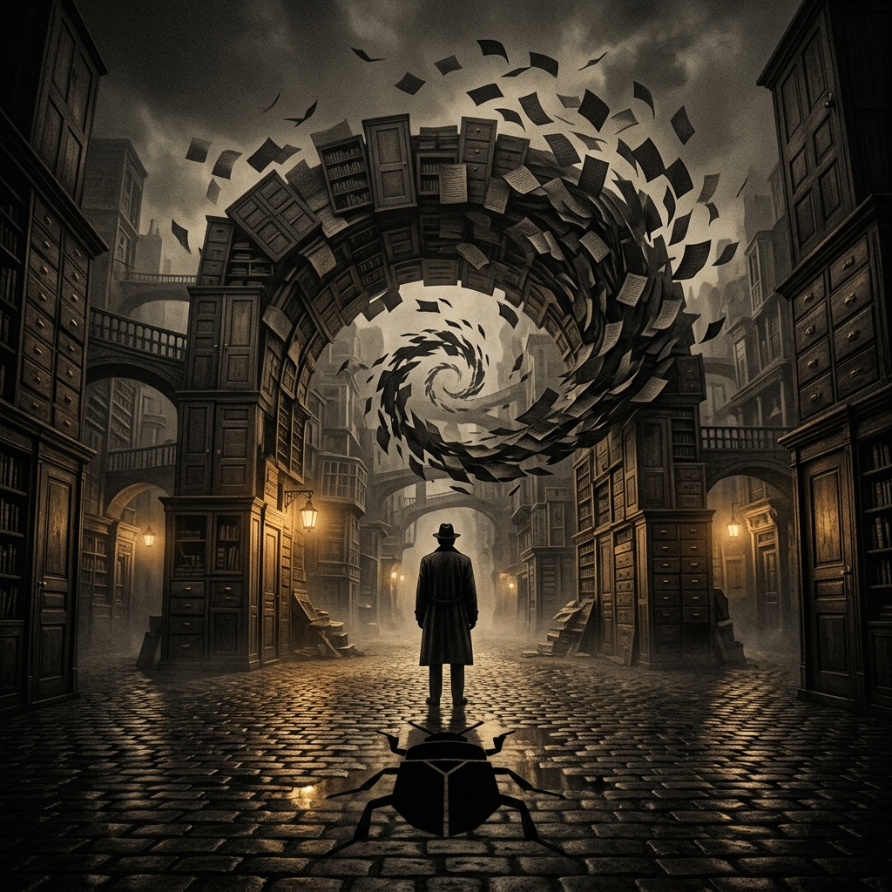
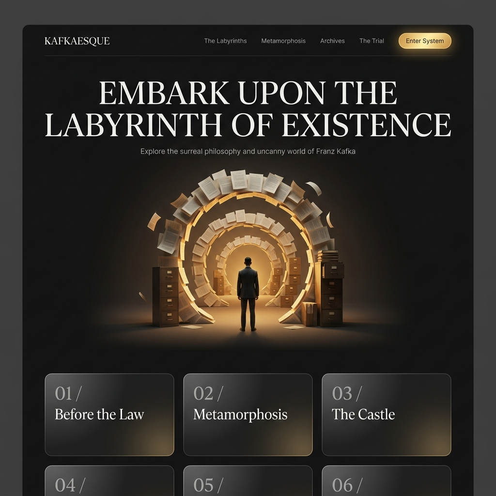
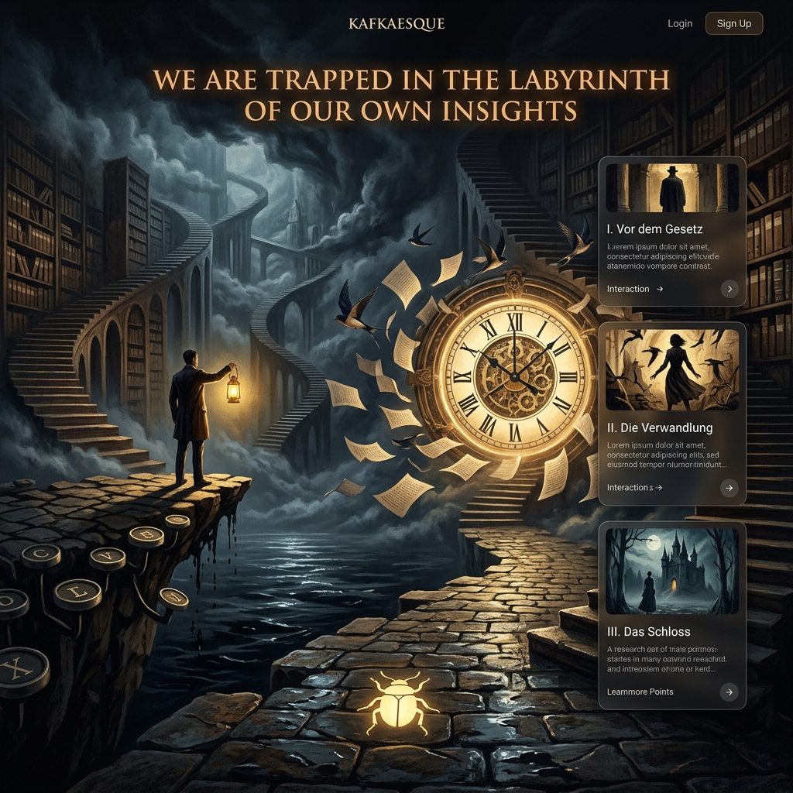
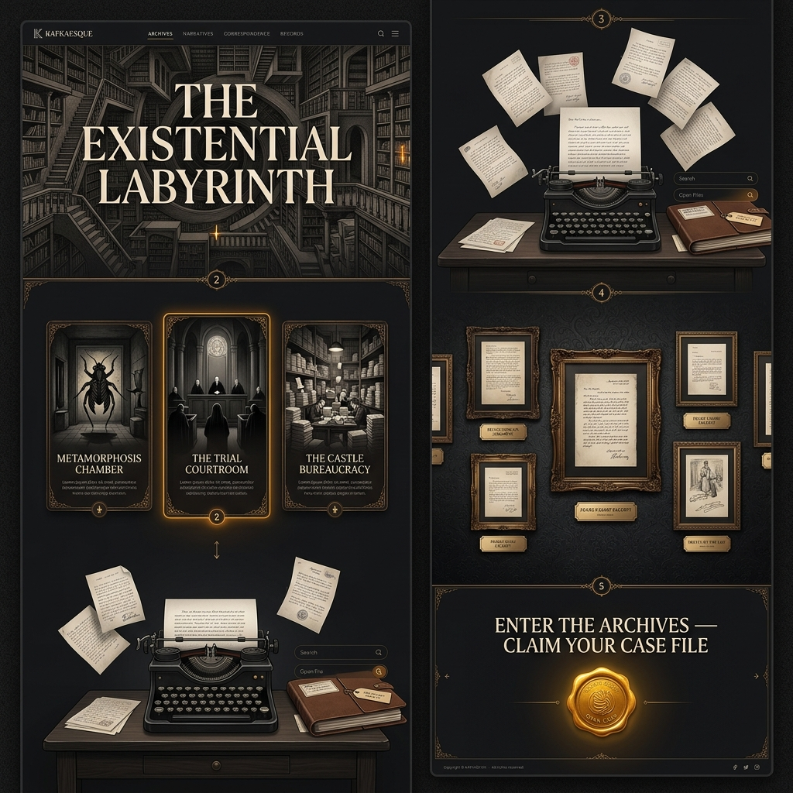

# 🏛️ KAFKAESQUE — The Existential Web Experience (Master Plan)

Welcome to the **Kafkaesque Web Experience Blueprint**. This directory contains the complete philosophical research, visual artwork gallery, full-page website architecture, and the comprehensive user onboarding/experience strategy guide.

---

## 🎨 1. Visual Artwork & Interface Gallery

### **A. Concept 1: The Labyrinth Archway & Metamorphosis Shadow**


> **Philosophical Theme**: A solitary silhouette standing in front of a gargantuan archival archway made of infinite doors and floating manuscript leaves, with a subtle beetle shadow on wet cobblestones.

---

### **B. Concept 2: Minimalist Dark Mode Homepage UI**


> **Design Aesthetic**: Monochromatic charcoal dark mode with golden gaslamp glow, featuring bold typography: *"EMBARK UPON THE LABYRINTH OF EXISTENCE"* and interactive chapter cards for *Before the Law*, *Metamorphosis*, and *The Castle*.

---

### **C. Concept 3: The Escher Cathedral & Clockwork Portal Masterpiece**


> **Philosophical Theme**: Escher-esque infinite staircases, a typewriter keycap cliff over dark ink waters, a colossal illuminated clockwork portal turning manuscripts into swallow birds, and the quote: *"WE ARE TRAPPED IN THE LABYRINTH OF OUR OWN INSIGHTS"*.

---

### **D. Concept 4: Full Multi-Section Website Homepage Scroll Layout**


> **Architecture Overview**: Complete 5-section homepage design including Hero Labyrinth, Three Canonical Chambers, Vintage Typewriter Studio, Manuscripts Gallery, and Onboarding Portal.

---

## 🏛️ 2. Complete Homepage Architecture

```
┌────────────────────────────────────────────────────────┐
│ 1. HERO SECTION                                        │
│    "THE EXISTENTIAL LABYRINTH"                         │
│    Escher Library Art & Dynamic Atmosphere             │
├────────────────────────────────────────────────────────┤
│ 2. THREE CANONICAL CHAMBERS                            │
│    • Metamorphosis Chamber (Isolation & Samsa)         │
│    • The Trial Courtroom (Unreachable Law & Arrest)    │
│    • The Castle Bureaucracy (Labyrinthine Officers)    │
├────────────────────────────────────────────────────────┤
│ 3. INTERACTIVE VINTAGE TYPEWRITER STUDIO               │
│    • 3D Mechanical Typewriter Desk                     │
│    • Real-time soundscapes & floating ink pages       │
├────────────────────────────────────────────────────────┤
│ 4. CORRESPONDENCE & MANUSCRIPTS ARCHIVE                │
│    • Framed Letters to Milena & Original Sketches     │
├────────────────────────────────────────────────────────┤
│ 5. ONBOARDING PORTAL CTA                               │
│    • "ENTER THE ARCHIVES — CLAIM YOUR CASE FILE"       │
│    • Golden Wax Seal Interactive Button                │
└────────────────────────────────────────────────────────┘
```

---

## 🕵️‍♂️ 3. User Onboarding & Logged-In Experience Strategy

### **A. Bureaucratic Case Registration (Auth System)**
Instead of standard login/signup, users register their **Existential Case File**:
- **Case ID Generation**: Each user gets assigned a unique number e.g. `CASE FILE #K-8492-Z`.
- **Citizen Alias**: Choose an alias such as *Josef K.*, *Surveyor K.*, or *Gregor S.*

### **B. The Daily Existential Trial**
Logged-in users receive a daily paradox prompt:
> *"A messenger arrives at a door that will never open for anyone else. Do you wait forever or turn back into the fog?"*

### **C. The Unlocked Door System**
Activity and reading unlock mysterious numbered doors granting access to:
- **Door #7**: Ambient cello audio recordings of *Letters to Milena*.
- **Door #14**: High-resolution scans of Franz Kafka's diary entries.
- **Door #21**: Access to *The Bureaucracy Courtroom Forum*.

### **D. The Bureaucracy Forum ("Petitions & Appeals")**
- **Posts = Petitions**: Discussions are framed as official citizen petitions.
- **Comments = Appeals / Verdicts**: Community members respond with appeals or verdicts.

---

## 🛠️ Recommended Tech Stack

- **Framework**: Next.js 14 (App Router) + React
- **Styling**: TailwindCSS + Framer Motion (Page Transitions & Micro-interactions)
- **Soundscape**: Howler.js (Mechanical typewriter key sounds & ambient music)
- **Database/Auth**: Supabase / NextAuth.js with custom `caseNumber` schema.
🏛️ হোমপেজের ৫টি প্রধান সেকশন:
Hero Labyrinth Section (হিরো সেকশন):
M.C. Escher-এর লাইব্রেরি আর্টওয়ার্ক এবং প্রদীপ্ত হেডার টাইটেল: "THE EXISTENTIAL LABYRINTH".
The 3 Canonical Chambers Section (তিনটি সাহিত্যিক চেম্বার):
Metamorphosis Chamber (রূপান্তর রুম)
The Trial Courtroom (রহস্যময় বিচারালয়)
The Castle Bureaucracy (দুর্গ ও আমলাতন্ত্রের গোলকধাঁধা)
Interactive Vintage Typewriter Studio (টাইপরাইটার সেকশন):
ভিন্টেজ টাইপরাইটার ডেস্ক—যেখানে ইউজাররা টাইপ করলে সাউন্ড ইফেক্টসহ হাতে লেখা পাতা বাতাসে উড়বে।
Historical Letters & Manuscripts Archive (চিঠিপত্র ও গ্যালারি):
কাফকার আসল পান্ডুলিপি, Letters to Milena, এবং দুর্লভ স্কেচ ফ্রেমড গ্যালারি।
Onboarding Portal CTA (লগইন/রেজিস্ট্রেশন পোর্টাল):
মোমের তৈরি দ্যুতিময় সিল বাটনসহ "ENTER THE ARCHIVES — CLAIM YOUR CASE FILE".
🕵️‍♂️ ২. ইউজার লগইন ও অভিজ্ঞতার গাইডলাইন (UX Strategy & Onboarding Guide)
ইউজারদের ওয়েবসাইটে যুক্ত করে কাফকার অনুভূতির সাথে পরিচয় করিয়ে দেওয়ার জন্য সম্পূর্ণ ডকুমেন্ট তৈরি করা হয়েছে:
kafkaesque_ux_guide_and_strategy.md

🔑 কিক অফ অনবোর্ডিং ও লগইন মেকানিক্স:
সাধারণ লগইন-এর বদলে "Case File" বরাদ্দ:
ইউজার সাইনআপ করলে তাকে সাধারণ আইডি না দিয়ে একটি Bureaucratic Case Number দেওয়া হবে (যেমন: CASE FILE #K-8492-Z).
The Daily Existential Trial (দৈনিক ট্রায়াল):
লগইন করা ইউজার প্রতিদিন কাফকার প্যারাডক্স থেকে একটি প্রশ্ন পাবে (যেমন: "যে দরজায় আপনার যাওয়ার কথা, তা কি অনন্তকাল খুলবে নাকি কুয়াশায় ফিরে যাবেন?")—যার উত্তর তাদের প্রোফাইল মিটার পরিবর্তন করবে।
Unlocked Door System (রহস্যময় দুয়ার উন্মোচন):
নিয়মিত পড়া ও যুক্ত থাকার মাধ্যমে ৭ম, ১৪তম এবং ২১তম দরজা আনলক হবে, যা কাফকার অডিও বুক, ডায়েরির গোপন পাতা ও বিশেষ ফোরাম আনলক করবে।
Bureaucracy Forum ("Petitions & Appeals"):
ফোরামের প্রতিটি পোস্টকে "Petition" (আবেদন) এবং কমেন্টকে "Appeal" (আপিল) বা "Verdict" (রায়) হিসেবে উপস্থাপন করা হবে।
